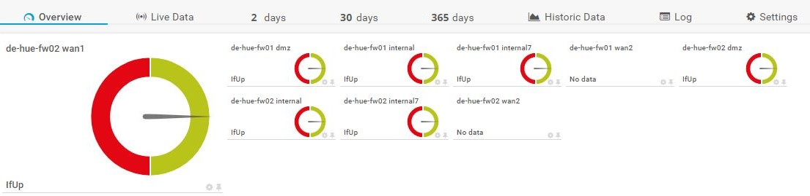
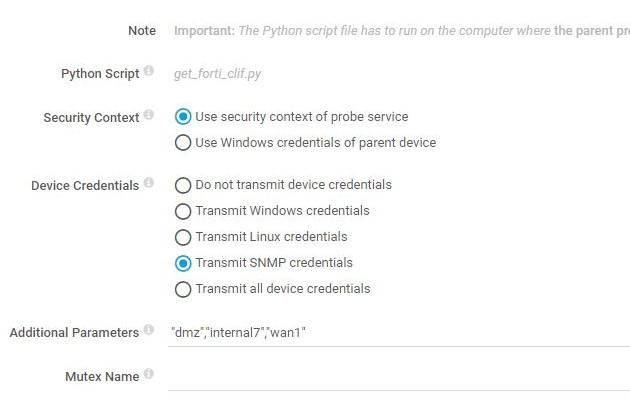

# prtg-fortigate_cluster

PRTG custom sensor to query nodes behind the virtual management IP



Slave Fortigate Cluster nodes send their management traffic [through the primary unit][mgmt-traffic] if no separate management IP is defined. This makes queries for interfaces with normal SNMP queries impossible, as an OID query to an interface of the subordinate unit returns `#N SNMP_EXCEPTION_NOSUCHINSTANCE`.

Slave nodes can be queried by appending the serial number to the SNMP community and querying the cluster IP. See [Fortinet Link for Monitoring HA Clusters][forti-link]

Sample Data Structure:

```sh
{'unit1': {'clIndex': '1',
           'hostname': 'de-xxx-fw02',
           'int': {'dmz': {'ifIndex': '3', 'ifstatus': '1'},
                   'internal': {'ifIndex': '101', 'ifstatus': '1'},
                   'internal7': {'ifIndex': '110', 'ifstatus': '1'},
                   'modem': {'ifIndex': '6', 'ifstatus': '2'},
                   'npu0_vlink0': {'ifIndex': '4', 'ifstatus': '2'},
                   'npu0_vlink1': {'ifIndex': '5', 'ifstatus': '2'},
                   'ssl.root': {'ifIndex': '7', 'ifstatus': '1'},
                   'wan1': {'ifIndex': '1', 'ifstatus': '1'},
                   'wan2': {'ifIndex': '2', 'ifstatus': '2'}},
           'serial': 'FGT60E4Q855555455',
           'snmpc': 'public-FGT60E4Q855555455'},
 'unit2': {'clIndex': '2',
           'hostname': 'de-xxx-fw01',
           'int': {'dmz': {'ifIndex': '3', 'ifstatus': '1'},
                   'internal': {'ifIndex': '101', 'ifstatus': '1'},
                   'internal7': {'ifIndex': '110', 'ifstatus': '1'},
                   'modem': {'ifIndex': '6', 'ifstatus': '2'},
                   'npu0_vlink0': {'ifIndex': '4', 'ifstatus': '2'},
                   'npu0_vlink1': {'ifIndex': '5', 'ifstatus': '2'},
                   'ssl.root': {'ifIndex': '7', 'ifstatus': '1'},
                   'wan1': {'ifIndex': '1', 'ifstatus': '1'},
                   'wan2': {'ifIndex': '2', 'ifstatus': '2'}},
           'serial': 'FGT60E4Q56565656565',
           'snmpc': 'public-FGT60E4Q56565656565'}}
```

Sample Sensor Output:

```json
6/26/2018 9:15:13 AM Exit Code: 0
6/26/2018 9:15:13 AM RawStream Size: 880
6/26/2018 9:15:13 AM OutputStream Size: 880
6/26/2018 9:15:13 AM Script Output (UTF8 Encoding): {"prtg": {"result": [{"ValueLookup": "custom.lookup.forti.interfaces",
 "Value": 1, "Channel": "de-xxx-fw02 wan1", "Unit": "Custom"}, {"ValueLookup": "custom.lookup.forti.interfaces",
 "Value": 1, "Channel": "de-xxx-fw02 internal", "Unit": "Custom"}, {"ValueLookup": "custom.lookup.forti.interfaces", 
 "Value": 1, "Channel": "de-xxx-fw02 dmz", "Unit": "Custom"}, {"ValueLookup": "custom.lookup.forti.interfaces", 
 "Value": 1, "Channel": "de-xxx-fw02 internal7", "Unit": "Custom"}, {"ValueLookup": "custom.lookup.forti.interfaces",
 "Value": 1, "Channel": "de-xxx-fw01 internal", "Unit": "Custom"}, {"ValueLookup": "custom.lookup.forti.interfaces",
 "Value": 1, "Channel": "de-xxx-fw01 dmz", "Unit": "Custom"}, {"ValueLookup": "custom.lookup.forti.interfaces",
 "Value": 1, "Channel": "de-xxx-fw01 internal7", "Unit": "Custom"}], "text": "OK"}}[CR][LF]
```

PySNMP class from [here][py-snmp-class]

## Installation

- Copy `prtg-custom-forti-cl.py` to: `C:\Program Files (x86)\PRTG Network Monitor\Custom Sensors\python\`
- Copy lookup file to: `C:\Program Files (x86)\PRTG Network Monitor\lookups\custom\` 
- Load custom lookup file: Setup - System Administration - Administrative Tools, 'Load Lookups and File Lists' -> Go
- Add new `Python Script Advanced` Sensor
- Select script in dropdown menu and create sensor
- Sensor settings
  - Select 'Transmit SNMP credentials'
  - Additional Parameters: Add interfaces to be monitored, e.g.: `"wan1","dmz","lan1"`



[mgmt-traffic]: http://help.fortinet.com/fos50hlp/54/Content/FortiOS/fortigate-high-availability-52/HA_operatingPrimaryRouter.htm
[forti-link]: http://help.fortinet.com/fos50hlp/54/Content/FortiOS/fortigate-high-availability-52/HA_operatingSNMP.htm
[py-snmp-class]: https://jcutrer.com/howto/dev/python/python-tutorial-query-dell-poweredge-temperature-snmp-data